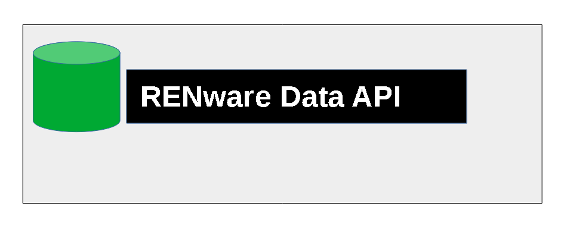

<small markdown>**RENware Software Systems**</small>




[TOC]

***

# End User Manual

This document presents **RENware Software Systems** company ***data API*** application provider. It refer the public company data.

**General information:**

* product p/n: `0000-0051`
* API type: `HTTP REST` for data purposes


## Routes general rules

There are 2 kind of routes:

* strict data GET routes, prefixed as
```
<BASE_URL>/data_sources/[entity name][/object name]
```

* "real" API routes that are able for complete ***CRUD*** operations to data, prefixed as **`.../api/<entity name>/<operation>/<object name>...`**


-#TODO: explain route parameters

-#TODO: other rules here ...


## Data format

-#TODO ...JSON... ALMOST...


## Route methods

-#TODO ...GET... ALMOST...


## Getting the information

-#TODO explain briefly how call `curl`


## Notes

`BASE_URL`
:    represents the `server name` part of the URL, ie at current version being `http://dataapi.renware.eu/` (please be aware to not duplicate last `/` character)

